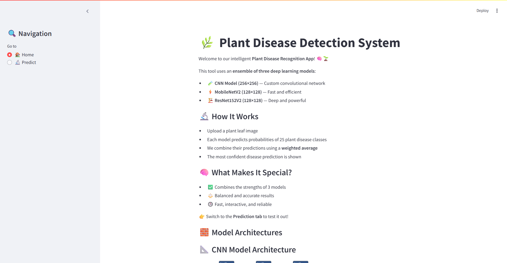

# 🌿 Plant Disease Detection Using Deep Learning

A deep learning-based solution that detects plant diseases from leaf images using an ensemble of **MobileNet**, **ResNet**, and a custom **CNN** model. The project features a **Streamlit-based frontend** to provide an interactive and user-friendly interface for real-time disease prediction.

---

## 📁 Project Structure Description

- **`app.py`**: Main Streamlit frontend application where users can upload plant leaf images and view predictions from the ensemble model.

- **`disease_info.json`**: JSON file containing metadata about each plant disease class, used to display information alongside predictions.

- **`my_modell.keras.png`**: Image visualizing the architecture of the custom CNN model used in the ensemble.

- **`plant_disease_mobilenet.ipynb`**: Jupyter Notebook for training and evaluating the MobileNet model on the PlantVillage dataset.

- **`plant_diseases_resnettt.ipynb`**: Jupyter Notebook for training and evaluating the ResNet model.

- **`plantdiseasefinall.ipynb`**: Final notebook that loads all three models (MobileNet, ResNet, CNN) and combines their predictions using an ensemble strategy.

- **`plant_disease_mobilenet_128.keras.png`**: Structural visualization of the MobileNet model.

- **`plant_disease_resnet152v2.keras.png`**: Structural visualization of the ResNet152V2 model.

- **`README.md`**: Documentation file describing the project, structure, setup, usage, and results.


---

## 🧠 Model Overview

This project uses **three deep learning models**:
- **MobileNetV2**: Lightweight and optimized for mobile devices.
- **ResNet152V2**: Deep residual network for robust classification.
- **Custom CNN**: Built from scratch for fast inference.

The final prediction is derived using an **ensemble approach**, where predictions from all three models are combined for higher accuracy and reliability.

---

## 🌱 Dataset

Used the **PlantVillage Dataset** with 25 classes:
- Crops: Apple, Corn, Grape, Potato, Tomato
- Labels include both **healthy** and **diseased** leaves.

---

## 🌐 Web Interface

The frontend is built using **Streamlit**, enabling users to:
- Upload a leaf image.
- View prediction probabilities from all 3 models.
- Display the final disease diagnosis.
- Get additional info from `disease_info.json`.
- 
- 

### 🔧 Run the App
```bash
streamlit run app.py


